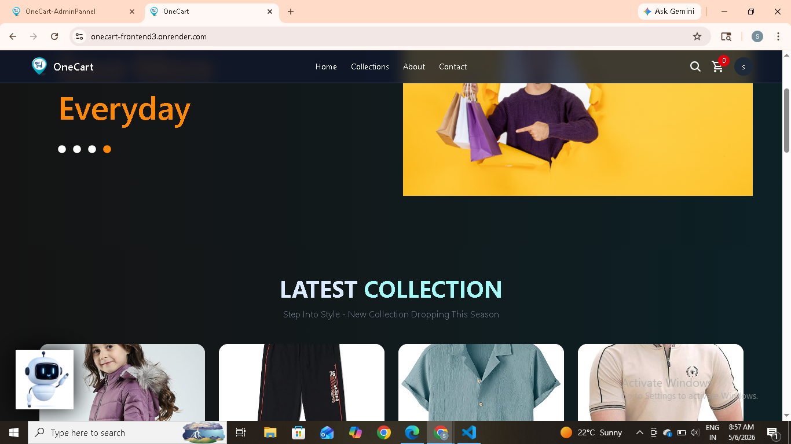
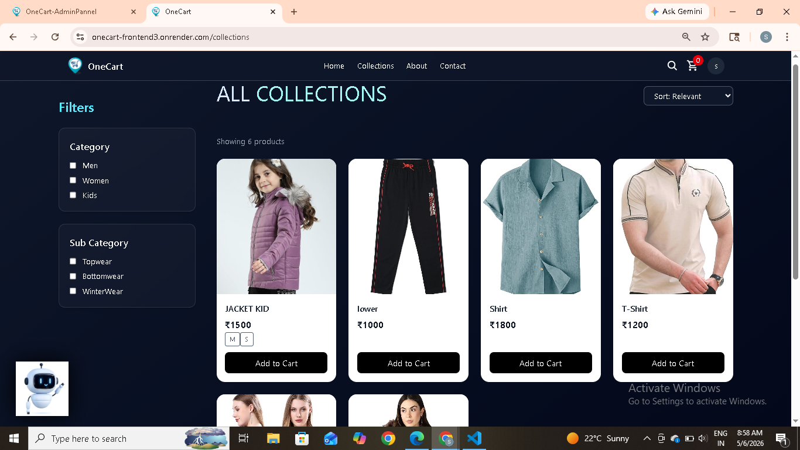
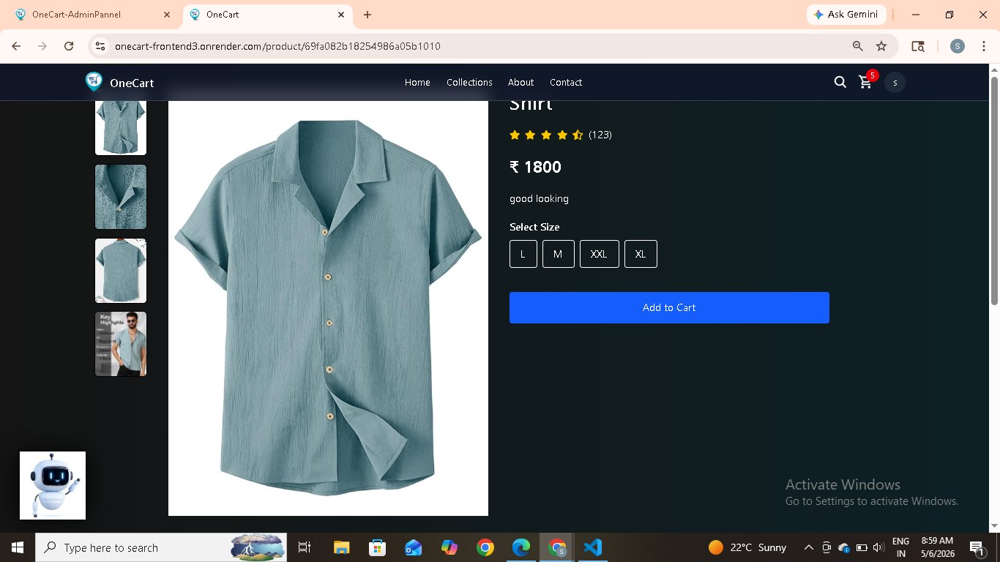
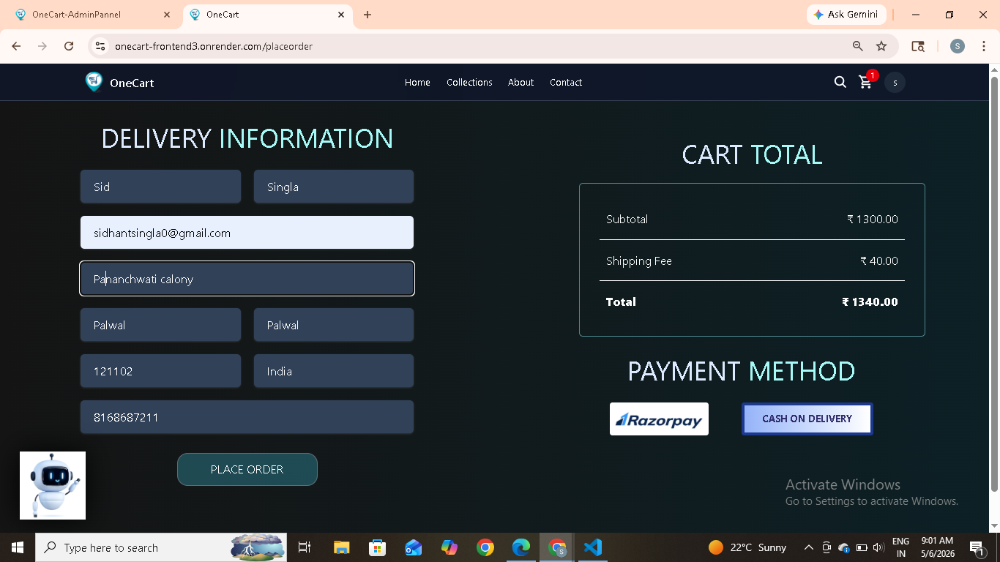
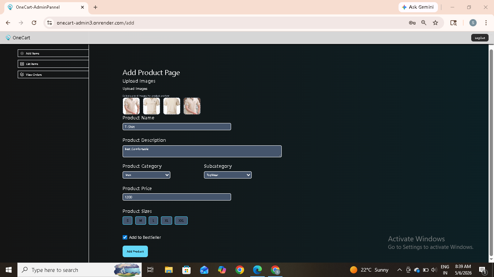
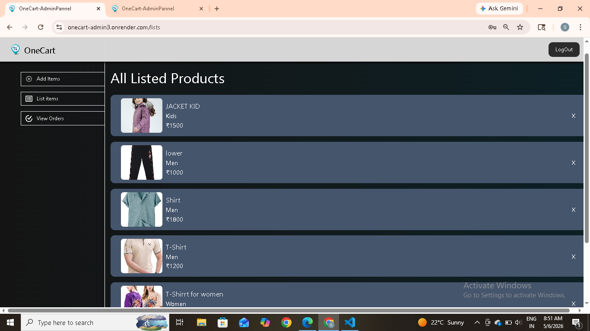

# 🛒 oneCart – MERN Stack E-Commerce Platform

A full-stack eCommerce web application built using the **MERN stack** with authentication, admin panel, cart system, and modern UI design.  
This project demonstrates real-world full-stack development practices including state management, secure APIs, and scalable architecture.

---

## 🚀 Live Demo

👉 https://onecart-frontend3.onrender.com/

---

## ✨ Features

### 👤 User Side
- User authentication (Signup / Login)
- Google OAuth login
- Browse products with categories
- Product detail page
- Add to cart / update quantity
- Persistent cart (synced with backend)
- Best sellers & latest collections
- Toast notifications for actions

---

### 🛠️ Admin Panel
- Add new products
- Upload product images (FormData)
- Manage product details (price, sizes, category)
- Toggle bestseller status
- View product list
- Responsive UI (mobile + desktop)

---

## 🔐 Roles

- **User** → Browse products, manage cart  
- **Admin** → Manage products and inventory  

---

## ⚙️ System Features
- JWT-based authentication
- Protected routes
- Role-based access control (Admin & User)
- Centralized API handling (Axios instance)
- React Context API for global state management
- Custom hooks (e.g. `useProducts`)
- MongoDB database integration
- Environment-based admin authentication

---

## 🧰 Tech Stack

### Frontend
- React (Vite)
- Tailwind CSS
- Axios
- React Router
- Context API

### Backend
- Node.js
- Express.js
- MongoDB + Mongoose

### Authentication
- JWT Authentication
- Google OAuth

---

## 🧠 Architecture

The application follows a client-server architecture:

- Frontend (React) communicates with Backend (Express) using REST APIs
- Axios is used for API requests
- JWT is used for authentication and protected routes
- MongoDB stores users, products, and cart data
- Context API manages global state (user, cart, products)

### Flow:
1. User logs in (JWT / Google OAuth)
2. Token stored on client
3. Requests include token
4. Backend validates token
5. Data fetched from MongoDB

---

## 📸 Screenshots

### 🏠 Home Page


### 🛍️ Collection Page


### 📦 Product / Order Page


### 🛒 Place Order Page


### 🛠️ Admin Add Product


### 📋 Admin Product List


---

## 🔐 Admin Access

The admin panel is protected using environment-based authentication.

👉 Admin Route:  
(https://onecart-admin3.onrender.com/)
Note:
- Admin access is secured via a password stored in backend environment variables
- Credentials are not publicly exposed for security reasons
- For demo access, please contact the developer


---

## 📁 Project Structure
```bash
oneCart/
│
├── frontend/        # User-facing application
│   ├── src/
│   │   ├── components/
│   │   ├── pages/
│   │   ├── context/
│   │   ├── hooks/
│   │   ├── config/
│   │   └── App.jsx
│
├── admin/           # Admin dashboard
│   ├── src/
│   │   ├── components/
│   │   ├── pages/
│   │   ├── context/
│   │   ├── config/
│   │   └── App.jsx
│
├── backend/         # API server
│   ├── controllers/
│   ├── models/
│   ├── routes/
│   ├── middleware/
│   └── server.js
```

---


## 🔌 API Features:


- RESTful API architecture
- Product APIs (CRUD)
- User authentication APIs
- Cart APIs (sync with database)
- Image upload handling using FormData

---


## 📦 Installation & Setup

### 1.Clone the repository

git clone https://github.com/your-username/oneCart.git

cd oneCart

### 2.Install dependencies

#### Backend:

cd backend
npm install

#### Frontend:

cd frontend
npm install

#### Admin:

cd Admin
npm install

## 3.Setup environment variables

#### Backend .env

MONGO_URI=your_mongodb_url
JWT_SECRET=your_secret_key
GOOGLE_CLIENT_ID=your_google_client_id
GOOGLE_CLIENT_SECRET=your_google_secret


#### Frontend .env

VITE_API_URL=http://localhost:5000

---


## Run the project:

### Start Backend:

npm start


### Start frontend:

npm run dev


### Start Admin:

npm run dev


---


## Key Concepts Implemented

- Authentication & Authorization (JWT + OAuth)
- State management with Context API
- API abstraction using custom hooks
- File uploads using FormData
- Component-based architecture
- Backend MVC pattern
- Secure API design

---


## Future Improvements

- Order management system
- Wishlist feature
- Product reviews & ratings
- Advanced admin analytics dashboard
- Redux Toolkit migration (optional scaling)


---


## Purpose of Project

This project was built to:

- Practice full-stack MERN development
- Understand real-world eCommerce architecture
- Implement authentication + state management
- Build a production-level portfolio project


---


## Author

Sidhant

Computer Science Engineering Student
Focused on MERN Stack & Full-Stack Development


---
## If you like this project

Give it a ⭐ on GitHub and feel free to fork it for learning!
